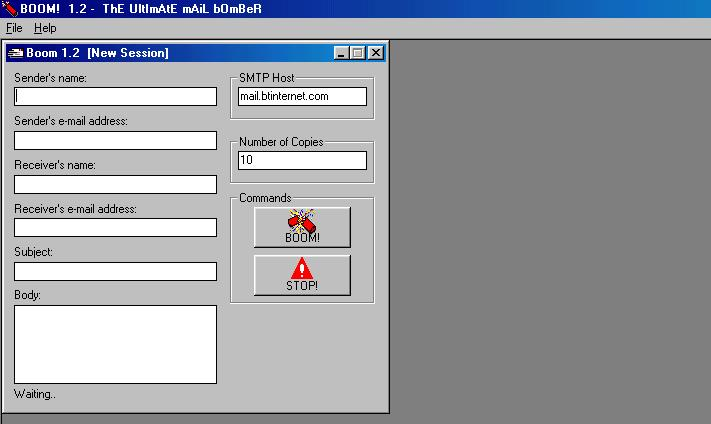



## BOOM\! 1\.2 \(Mail Bomber\!\)

### Description

BOOM! is back! Now with a stylish GUI and multiple sessions! Boom 1.2 includes -

*Anonymous Email Service (Thanks to Zelda)

*Stylish GUI and Easy to use Interface

*Multiple Session support

*Log File support (BOOM now logs your sessions so you can see exactly what is happening)
 
### More Info
 
BOOM! has now been tested on Windows 98SE and Windows 2000. It appears to be very stable! However if you find any bugs just mail me and I will fix them in the next release!

PLEASE NOTE THAT MAILLBOMNING IS AN ILLEGAL / CRIMINAL ACTIVITY. THE AUTHOR DOES NOT SUPPORT MAIL BOMBING AND WILL NOT PERMIT YOU TO USE THIS SOFTWARE FOR SUCH PURPOSES. THIS CODE IS PROVIDED FOR EDUCATIONAL PURPOSES ONLY!

             |
---                |---
**Submitted On**   |2000-11-12 16:44:54
**By**             |[Mahangu](https://github.com/Planet-Source-Code/PSCIndex/blob/master/ByAuthor/mahangu.md)
**Level**          |Intermediate
**User Rating**    |3.7 (11 globes from 3 users)
**Compatibility**  |VB 6\.0
**Category**       |[Complete Applications](https://github.com/Planet-Source-Code/PSCIndex/blob/master/ByCategory/complete-applications__1-27.md)
**World**          |[Visual Basic](https://github.com/Planet-Source-Code/PSCIndex/blob/master/ByWorld/visual-basic.md)
**Archive File**   |[CODE\_UPLOAD1160511122000\.zip](https://github.com/Planet-Source-Code/mahangu-boom-1-2-mail-bomber__1-12727/archive/master.zip)

